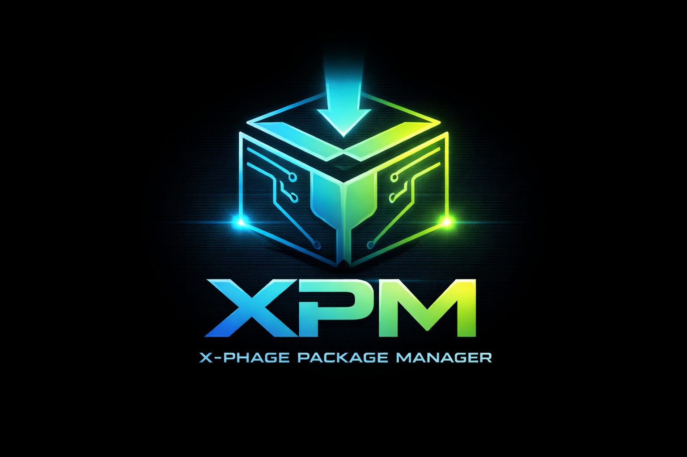

# XPM Central Registry

<p align="center">
  
</p>

<p align="center">
  <b>High-performance, secure package registry for the X-Phage ecosystem</b>
</p>

<p align="center">
  
  
  
  
  
</p>

---

## Overview

XPM (X-Phage Package Manager) Registry is the official distribution hub for external modules used in the X-Phage programming ecosystem.

It connects the Titan Core compiler with community and first-party packages while maintaining strict guarantees on:

- Dependency resolution  
- Security and integrity  
- Version consistency  
- Performance  

Unlike the built-in standard library, XPM hosts optional and extensible modules such as:

- AI / ML components  
- BCI hardware drivers  
- Game engine modules  
- System-level integrations  

This design ensures a minimal core and a scalable ecosystem.

---

## Quick Start

### Initialize Project

```bash
xphage init
```
This creates:

**1.xphage.pkg (dependency manifest)**
**2.X-Phage.lock (locked dependency graph)**

---

## Install Package

xphage install bci@1.2.0 

---
## Installation Pipeline

```
User Command
    ↓
X-Phage CLI
    ↓
Registry Lookup (index.json)
    ↓
Version Resolution
    ↓
Download (.xh + .sha256)
    ↓
SHA-256 Verification
    ↓
Install → modules/
    ↓
Update pkg + lock file
```

---

## Project Structure

```
project/
 ├── modules/
 │    └── bci/
 │         ├── bci.xh
 │         └── bci.sha256
 ├── xphage.pkg
 └── X-Phage.lock
 
```

## Usage Example

```
~link "bci/bci.xh"

pulse main {
    bci.connect("openbci", "/dev/ttyUSB0")
    beam ">> Neural Synapse Active."
}

```

---

## Architecture 

```
XPM Registry (index.json)
                 │
                 ▼
           XPM CLI
                 │
                 ▼
        Local Project (modules/)

```

## Developer Guide

**Packaging Standard**

**1.Format: Single .xh file**

**2.Versioning: Semantic Versioning (SemVer 2.0.0)**

**3.Integrity: SHA-256 checksum required**

**4.Metadata: Author, License, Description**


## Publishing Workflow

**1.Create GitHub Release**

**Tag format:**

package@Version 

***Upload:***

- .xh 
- .sha256 

**2. Update index.json**

```
{ "packages": { "your_package": { "owner": "your_username", "description": "Short description", "latest": "1.0.0", "versions": ["1.0.0"] } } }
```

---

**3.Submit Pull Request**

- Fork xpm-registry
- Open PR

## Review includes:

- Security validation
- Performance checks
- Packaging compliance

---

## Security 

**Zero Trust Model**

- Nothing is trusted by default

## Integrity Verification 

- SHA-256 validation 
- Mismatch = installation fails 

## Immutable Versions 

- Versions cannot be modified
- Fix requires new release 

## Protection

- Prevents tampering
- Prevents supply chain attacks

---
## 📊 Feature Comparison

| Feature            | XPM | Traditional PM |
|--------------------|-----|----------------|
| Zero Trust         | Yes | No             |
| Immutable Versions | Yes | Partial        |
| Checksum Built-in  | Yes | Partial        |
| Lightweight Core   | Yes | No             |

---
## Licensing

- First-party modules: Apache 2.0 
- Third-party modules: Author defined 
---

## Repository 

Main Repo:
AeonCoreX-Lab/X-Phage

---

## Roadmap 

- Distributed registry mirrors
- Parallel dependency fetching
- Smart dependency resolver
- Signed packages

---
**© 2026 AeonCoreX.All Rights Reserved**